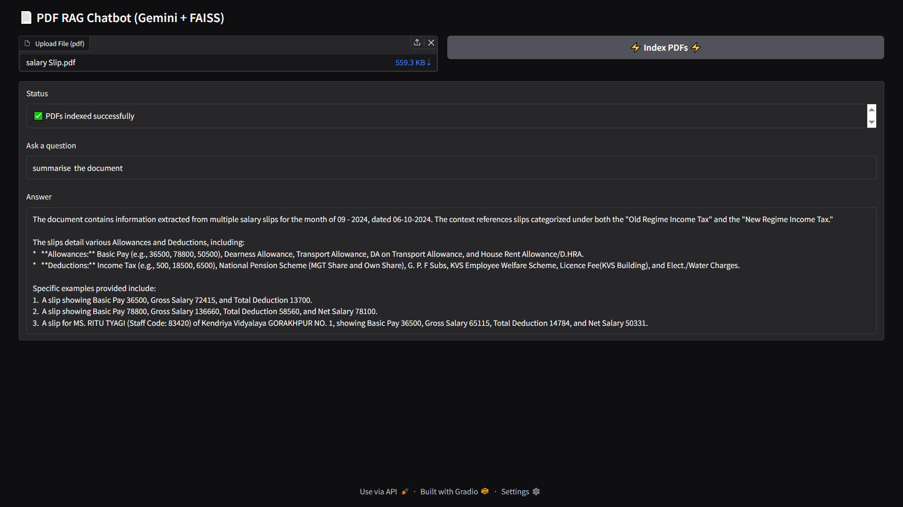
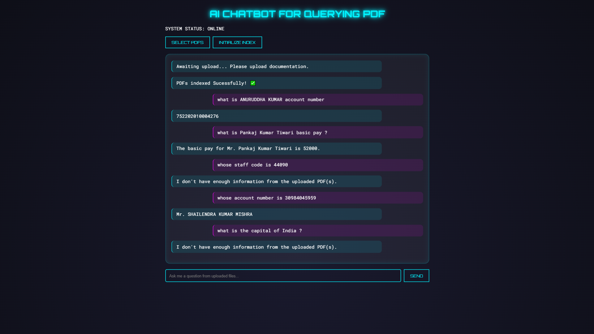

# PDF RAG Chatbot (chatbot_v2_rag)

A Retrieval-Augmented Generation (RAG) based AI chatbot that allows users to upload multiple PDF documents and ask natural language questions over them. The system retrieves relevant text chunks using vector search and generates grounded answers using an LLM.

To check Project Demo [Click Here](https://huggingface.co/spaces/bro-tinka/AiPdfChatbot_Version2)

---

## 🚀 Features

- Upload and index multiple PDF files
- Automatic text extraction and chunking
- Semantic search using embeddings + FAISS
- LLM-based answer generation (RAG)
- Simple web UI (HTML + JS)
- FastAPI backend
- Local and deployable setup

---

## 🧠 Architecture Overview

```
User Upload Pdf ──► Chunking ──► Embeddings ──► Stored in FAISS vector database
     │
     ▼
User Question
     │
     ▼
[ Retriever ] ──► Embeddings ──►Search FAISS Vector Index ──► return Relevant Chunks
     │
     ▼
[ Generator (LLM) ] ──► generates natural response from retrieved chunks
     │
     ▼
 Final Answer
```

Flow:
1. User uploads PDFs
2. PDFs are parsed and split into chunks
3. Chunks are embedded and indexed in FAISS
4. On query, top‑K relevant chunks are retrieved
5. LLM generates answer using retrieved context

---

## 🛠️ Tech Stack

- **fastAPIBackend:** FastAPI
- **Frontend:** HTML, CSS, JavaScript
- **PDF Parsing:** PyMuPDF (fitz)
- **Embeddings:** SentenceTransformers
- **Vector Store:** FAISS
- **LLM:** Gemini (gemini-3-flash-preview)

---

## 📁 Project Structure

```
AI CHATBOT
│   app_gradio.py   --- │\  OPTION 1
│   app_fastapi.py  --- │/  OPTION 2
│   readme.md
│
├── generator/
│   └── generator.py
│
├── retriever/
│   └── retriever.py
│
├── static/
│   ├── logic.js
│   └── style.css
│
├── templates/
│   └── index.html
│
└── temp_pdfs/        # ignored via .gitignore
```

---

## ⚙️ Setup Instructions

### 1️⃣ Create virtual environment & activate it


```bash
conda create -n env_chatbot
```
```bash
conda activate env_chatbot
```


### 2️⃣ Install dependencies

```bash
pip install -r requirements.txt
```

---

## 3️⃣ Environment Variables

Set your LLM API key as an environment variable:

**Windows**
```bash
set GEMINI_API_KEY=your_api_key_here
```

**Linux / Mac**
```bash
export GEMINI_API_KEY=your_api_key_here
```

---

##  4️⃣ Run the Application▶️


STEP 1 : Go to `AI CHATBOT` in terminal:

**Method1 : app-gradio (built in ui)**
```bash
uvicorn app_gradio:app --host 0.0.0.0 --port 7860
```

**Method2 : app-fastapi (custom html css js)**
```bash
uvicorn app_fastapi:app --host 0.0.0.0 --port 7860 
```

## Screenshots

### Method 1 : Gradio built interface


### Method 2 : FastAPI built custom interface



Open in browser:
```
http://localhost:7860
```
OR 
```
http://127.0.0.1:7860
```

---

## 🧪 How to Use

1. Upload one or more PDF files
2. Wait for indexing confirmation
3. Enter your question in the input box
4. Get an AI‑generated answer based on your PDFs

---

## 🎯 Example Queries

- "What this document is about"
- "Summarize chapter 3"
- "What methods are used in this paper?"
- "Explain Doppler broadening"
- "Compare results from two documents"
---

## 🔥 Why This Project Matters

This project demonstrates:

- End‑to‑end RAG pipeline
- Vector database integration
- PDF ingestion & preprocessing
- Backend + frontend integration


## 🛣️ Future Improvements

- Source citation (PDF + page number)
- Chat history
- Storing last LLM response
- UI enhancements
- Confidence Score based answering
- Docker deployment

---

## 📜 License

This project is for educational and research purposes.

---

## 👤 Author

**bro-tinka**  
AI / ML Enthusiast | RAG Systems | Backend + AI Engineering

---

⭐ If you find this project useful, consider giving it a star on GitHub.
💝  Follow me on Linkedin : https://www.linkedin.com/in/trivendra-singh-bisht/

💚💙🧡💖❣💕💞💓💗💖💖💗💓💞💕💜💘🧡💙💚

