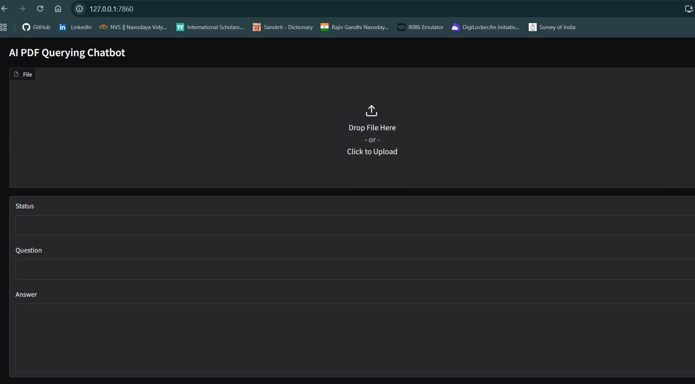
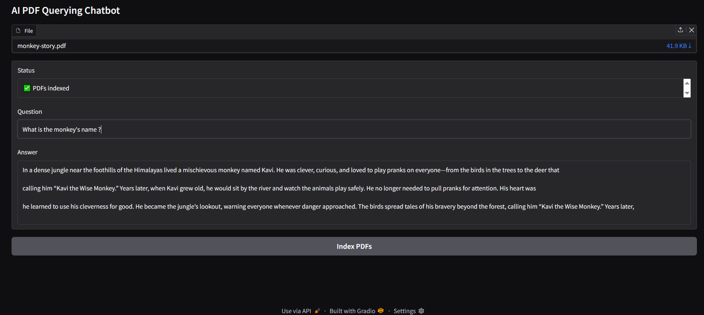

# 📄 Multi-PDF Question Answering Chatbot

A lightweight PDF-based semantic search chatbot that allows users to upload one or more PDFs, index them using transformer embeddings and FAISS, and ask natural language questions to retrieve relevant content.

Built with **Gradio**, **Sentence Transformers**, and **FAISS**.

---

## 🚀 Features

- Upload **one or multiple PDFs**
- Semantic search using transformer embeddings
- Fast similarity search with FAISS
- **Per-user session isolation** (no data leakage)
- Works locally and on **Hugging Face Spaces**
- Minimal and production-safe design

---

## 🧠 Tech Stack

- Python 3.10
- Gradio
- Sentence-Transformers (`all-MiniLM-L6-v2`)
- FAISS (CPU)
- PyMuPDF

---

## 📁 Project Structure

pdf_chatbot/
│
├── app.py
├── requirements.txt
└── README.md

---

## 📸 Screenshots

### Application Interface



> Example showing PDF UI



> Example showing PDF response

---

## ⚙️ Setup (Local) - Environment creation , installing dependencies

```bash
conda create -n env_chatbot python=3.10 -y
conda activate env_chatbot
pip install -r requirements.txt
python app.py
